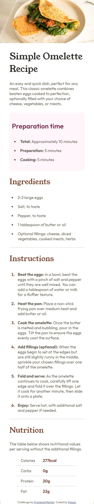

## Table of contents

- [Overview](#overview)
  - [The challenge](#the-challenge)
  - [Screenshot](#screenshot)
  - [Links](#links)
- [My process](#my-process)
  - [Built with](#built-with)
  - [What I learned](#what-i-learned)
  - [Continued development](#continued-development)
  - [Useful resources](#useful-resources)
- [Author](#author)
## Overview

### Screenshot
Desktop version

Mobile Version

### Links

- Solution URL: [https://github.com/Benson0721/omelette_recipe]
- Live Site URL: [https://benson0721.github.io/omelette_recipe/]

## My process

### Built with

- Semantic HTML5 markup
- CSS custom properties
- Flexbox
- PostCss-Postprocessor
- Mobile-first workflow
- Scss

### What I learned

It is My first time to use something like PostCss to help me sorting css properties,
and through this practise, I found my misunderstanding about css unit-vh and %, 
I spend sometime to overcome the problem of layout problem.
It was a very precious experience for me!

### Continued development

Since I finally finish the first progress of the Mentor challenge,
I want to do more practise about javascript!
I already have basic concept for that, but still not practise enough!

### Useful resources

- [https://www.youtube.com/watch?v=Kn2SKUOaoT4&t=573s]- This helped me for learn PostCss.

## Author

- Website - [https://github.com/Benson0721]
- Frontend Mentor - [https://www.frontendmentor.io/profile/Benson0721]

